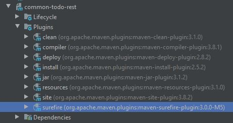

# 1. add to `<pluginManagement>`
Add plugin to pluginManagement in parent pom

```
    <build>
        <pluginManagement>
            <plugins>
                <plugin>
                    <groupId>org.apache.maven.plugins</groupId>
                    <artifactId>maven-surefire-plugin</artifactId>
                    <version>3.0.0-M5</version>
                </plugin>
            </plugins>
        </pluginManagement>
    </build>
```
**parent pom**

Plugin is now available in every child module.



But plugin is not yet run at build of a child module.

# 2. add to `<build>`
Add plugin to build in child pom

```
    <build>
        <plugins>
            <plugin>
                <groupId>org.apache.maven.plugins</groupId>
                <artifactId>maven-surefire-plugin</artifactId>
            </plugin>
        </plugins>
    </build>
```
**child pom**

Now, plugin is attached to the child modules build lifecycle 
and finally run when building the module 
