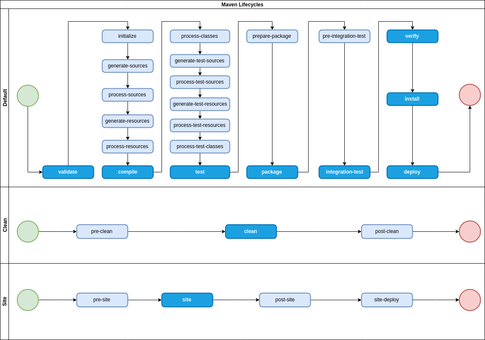
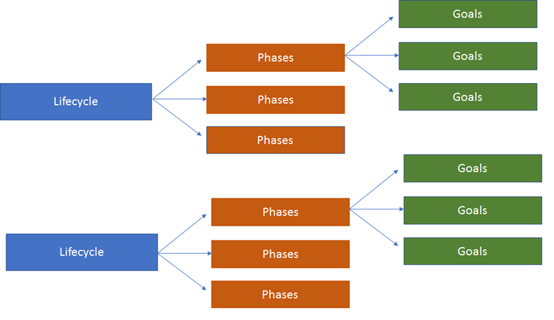

# Build Lifecycles
Maven defines three build lifecycles:  
- _default_ - build process
- _site_ - building a site, showing Maven related information of the project
- _clean_ - removing files generated in the previous build

Many phases in all three lifecycles are automatically bound to the goals of core plugins. 

# Terminology
**Lifecycle** is a collection of sequenced and named stages.

**Phase** is named stage in the build process which can execute zero or more actions.

**Plugin** is an artifact with one or more **goals**.

**Goal** is an action that can be executed.

# Plugins Bound to the Default Lifecycle
  Plugin goals are bound to a maven phase. 
  Core Plugins are bound to a given phase by default
  
  Format: `phase -> plugin:goal`
  
  - process-resources -> resources:resources
  - compile -> compiler:compile
  - process-test-resources -> resources:testResources
  - test-compile -> compiler:testCompile
  - test -> surefire:test
  - package -> ejb:ejb or ejb3:ejb3 or jar:jar or par:par or rar:rar or war:war
  - install -> install:install
  - deploy -> deploy:deploy